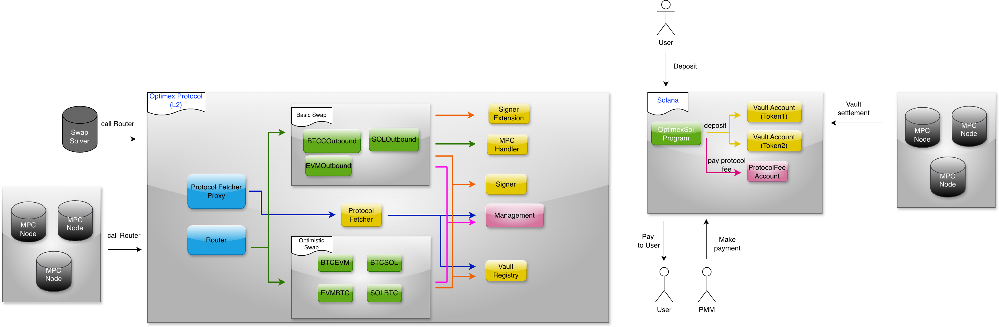

### Optimex Swap Solana Protocol

#### Protocol Features

1. **Cross-Chain Compatibility**: The Optimex Swap Protocol operates seamlessly across multiple networks. The Solana smart contract serves as a settlement layer for efficient cross-chain trades to and from Solana.

2. **Scalability**: Utilizing a L2 network enhances transaction throughput and reduces fees, enabling efficient high-volume trading operations.

3. **Security**: Built on proven Solana security patterns including PDA validation, multi-signature authorization, and role-based access controls. User funds remain under cryptographic control with no authorized party having direct access.

#### Deployed Contracts
- `Solana`:

    - **Contract Address**: [`E2pt2s1vZjgf1eBzWhe69qDWawdFKD2u4FbLEFijSMJP`](https://solscan.io/account/E2pt2s1vZjgf1eBzWhe69qDWawdFKD2u4FbLEFijSMJP)
    - **Management account**:
        - `Config`: [`APG8CAk2PAY2GrjMEUAPF2ZkAhNWK1SYDigKbLR5EHyz`](https://solscan.io/account/APG8CAk2PAY2GrjMEUAPF2ZkAhNWK1SYDigKbLR5EHyz)
        - `Protocol`: [`9oGcnTY1ngXhhko5dScHgVsLqZW6kEaGVM3EhCMSrwnX`](https://solscan.io/account/9oGcnTY1ngXhhko5dScHgVsLqZW6kEaGVM3EhCMSrwnX)
    - **Assets**:
        - `WSOL`: [`So11111111111111111111111111111111111111112`](https://solscan.io/token/So11111111111111111111111111111111111111112)
        - `USDC`: [`EPjFWdd5AufqSSqeM2qN1xzybapC8G4wEGGkZwyTDt1v`](https://solscan.io/token/EPjFWdd5AufqSSqeM2qN1xzybapC8G4wEGGkZwyTDt1v)
        - `USDT`: [`Es9vMFrzaCERmJfrF4H2FYD4KCoNkY11McCe8BenwNYB`](https://solscan.io/token/Es9vMFrzaCERmJfrF4H2FYD4KCoNkY11McCe8BenwNYB)

#### Optimex Authorized parties

Optimex is a decentralized protocol. While it requires authorized parties to perform certain management operations to ensure proper functionality, these operations cannot access user assets, maintaining complete user control over their funds at all times.

There are three authorized parties in the Optimex Protocol:

- `Upgradable authority`: The authority with permission to upgrade or delete the protocol. As the highest level authority in the protocol, it requires careful protection, potentially through a multisig wallet solution like [Squads](https://v3.squads.so/connect-squad). This authority is automatically granted to the protocol deployer.

- `Admin`: The authority responsible for managing protocol operators. There is a single Admin, appointed by the Upgradable authority during protocol initialization via the `Init` instruction.

- `Operator`: Authorities that manage the protocol's whitelisted tokens. Only whitelisted tokens can be used for trading and payments within Optimex. Up to 3 Operators can exist, managed by the Admin through the `AdminAddOrRemoveOperator` instruction.